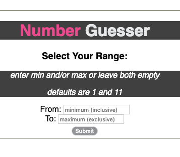
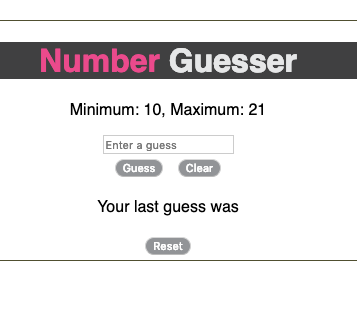

# Number Guesser

[deployed](https://stoic-plus.github.io/number_guesser/)

Guess a number between the range you provide.
* Guess right and the range increases
  * minimum goes down by 10, maximum up by 10

* Reset the game at any time and pick a new range

## Screenshots

__With custom range input!__

__Make a guess, clear made guess, or reset the game__

__get immediate feedback on the guess you made!__

#### Built With

* HTML, CSS, and JS (
* __requirejs__ to enable using modules client side

## Author

* **Ricardo Ledesma** - [Personal Site](https://ricardoledesma.tech)

Not my first time writing Javascript but this was my first time doing TDD with Javascript!
